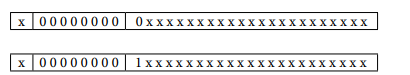

# Arytmetyka Stało i Zmienno przecinkowa

## Arytmetyka Stałoprzecinkowa

Arytmetyka stałoprzecinkowa (eng. fixedpoint), jest jednym ze sposobów zapisu liczb ułamkowych. W przeciwieństwie do zmiennoprzecinkowej, stały przecinek ma arbitralnie przypisane wagi, a pozycja przecinka jest ustalana arbitralnie. 

```
Na przykład: mając do dyspozycji słowo 32-bitowe, można wydzielić 24 bity na część całkowitą, 8 bitów na część ułamkową, albo po 16 bitów na część całkowitą i ułamkową, albo 30 bitów na część całkowitą i zostawić tylko 2 bity do zapisu części ułamkowej.
``` 
(src. https://pl.wikipedia.org/wiki/Kod_sta%C5%82opozycyjny)

Przypadki skrajne to :
- cała liczba będąca ułamkiem (przecinek maksymalnie po lelwej).
- cała liczba będąca liczbą całkowitą (przecinek maksymalnie po prawej)

### Zalety tej metodyki. 

### 1. Dodawanie 
Dodawanie w fixed-point polega na sumowaniu bitów jak w arytmetyce całkowitej, ale z uwzględnieniem pozycji przecinka. Jeśli przepełnienie, może wystąpić overflow.
#### Sytuacja 1: Przecinek w tym samym miejscu (obie w Q4.4)
Przykłady liczb (8 bitów całkowitych, przecinek po 4 bitach):

A: 0010.1010 bin = 2.625 dec (całkowita reprezentacja: 00101010 bin = 42 dec, podzielone przez 2^4 = 16 → 42/16 = 2.625)
B: 0001.1100 bin = 1.75 dec (całkowita: 00011100 bin = 28 dec, 28/16 = 1.75)

Kroki:

1. Dodaj jak liczby całkowite: 00101010 + 00011100 = 01000110 bin = 70 dec.
2. Interpretuj wynik w tym samym formacie Q4.4: 0100.0110 bin = 4.375 dec (70/16 = 4.375).
3. Sprawdź overflow: Jeśli suma przekracza zakres (np. > 15.9375 dla Q4.4 niepodpisanej), zgłoś błąd; tu OK.

Wynik: 2.625 + 1.75 = 4.375 (poprawnie).
#### Sytuacja 2: Przecinek w różnych miejscach (A w Q4.4, B w Q3.5)
Przykład: Dodajmy 10.10 (2.5 dec, 2 bity po przecinku) + 01.110 (1.75 dec, 3 bity po przecinku).

Wyrównanie: Przesuń pierwszą liczbę w prawo o 1 bit (dodaj zero po przecinku), aby obie miały 3 bity po przecinku: 0010.100 + 0001.110.
```
0010.100
+ 0001.110
----------
  0100.010  (4.25 dec)
```
Wynik: 100.010 (4.25 dec). Jeśli wynik ma więcej bitów po przecinku niż oczekiwane, można zaokrąglić lub obciąć.

### 2. Odejmowanie
Odejmowanie to dodawanie liczby ujemnej (np. w uzupełnieniu do dwóch dla liczb ze znakiem). Dla liczb bez znaku zakładamy, że odjemnik jest mniejszy.
#### Przypadek 1: Przecinek w tym samym miejscu (np. obie mają 3 bity po przecinku)
Przykład: Odejmij 10.101 (2.625 dec) - 01.110 (1.75 dec).

Liczby: 0010.101 - 0001.110.
Odejmowanie bit po bicie (z pożyczaniem):
```
0010.101
- 0001.110
----------
  0000.111  (0.875 dec)
```
Wynik: 0.111 (0.875 dec). Brak problemów z precyzją.

#### Przypadek 2: Przecinek w różnych miejscach (np. pierwsza ma 2 bity po przecinku, druga – 3 bity)
Przykład: Odejmij 10.10 (2.5 dec, 2 bity) - 01.110 (1.75 dec, 3 bity).

Wyrównanie: Przesuń pierwszą w prawo: 0010.100 - 0001.110.
Odejmowanie:
```
0010.100
- 0001.110
----------
  0000.110  (0.75 dec)
```
Wynik: 0.110 (0.75 dec). Możliwe pożyczanie przez przecinek.

### 3. Mnożenie
Mnożenie w fixed-point to mnożenie jak liczb całkowitych, a następnie przesunięcie wyniku o sumę bitów po przecinku w obu liczbach.
#### Przypadek 1: Przecinek w tym samym miejscu (np. obie mają 3 bity po przecinku)
Przykład: Pomnóż 10.101 (2.625 dec) × 01.110 (1.75 dec).

Traktuj jako całkowite: 10101 (21 dec) × 1110 (14 dec) = 0100100110 (294 dec).
Przesuń wynik w lewo o 0 (niepotrzebne, bo mnożenie całkowitych), ale podziel przez 2^(3+3) = 2^6 (przesuń w prawo o 6 bitów): 100.10110 (4.59375 dec, zaokrąglone).
Pełne mnożenie binarne:
```
0010.101 × 0001.110 = 0100.100110 (4.59375 dec)
```
Wynik ma 6 bitów po przecinku; obetnij do 3: 100.101 (4.625 dec, z błędem zaokrąglenia).

#### Przypadek 2: Przecinek w różnych miejscach (np. pierwsza ma 2 bity po przecinku, druga – 3 bity)
Przykład: Pomnóż 10.10 (2.5 dec) × 01.110 (1.75 dec).

Traktuj jako całkowite: 1010 (10 dec) × 1110 (14 dec) = 000111100 (140 dec).
Przesuń w prawo o 2+3=5 bitów: 100.011 (4.375 dec).
Mnożenie binarne:
```
0010.10 × 0001.110 = 0100.0110 (4.375 dec)
```
Wynik ma 5 bitów po przecinku; dostosuj do pożądanej precyzji.
- Dla 3 bitów po przecinku -> 100.011 (4.375)
- Dla 2 bitów po przecinku -> 100.10 (4.5)

4. Dzielenie
Dzielenie w fixed-point to dzielenie jak liczb całkowitych, z przesunięciem dzielnej w lewo o liczbę bitów po przecinku w dzielniku, aby zachować precyzję.
#### Przypadek 1: Przecinek w tym samym miejscu (np. obie mają 3 bity po przecinku)
Przykład: Podziel 10.101 (2.625 dec) / 01.110 (1.75 dec).

Przesuń dzielną w lewo o 3 bity (dodaj zera): 10101.000 / 1110.
Dzielenie binarne: 10101.000 ÷ 1110 ≈ 1.100 (1.5 dec, bo 2.625 / 1.75 = 1.5).
Wynik: 1.100 (3 bity po przecinku).

#### Przypadek 2: Przecinek w różnych miejscach (np. pierwsza ma 2 bity po przecinku, druga – 3 bity)
Przykład: Podziel 10.10 (2.5 dec) / 01.110 (1.75 dec).

Przesuń dzielną w lewo o 3 bity (liczba po przecinku w dzielniku): 101000.000 / 1110.
Dzielenie: ≈ 100.100 (4.5 dec? Błąd: 2.5 / 1.75 ≈ 1.4286 dec).
Poprawne: Dostosuj przesunięcie o różnicę (2 vs 3): Przesuń dodatkowo o 1 bit w lewo. Wynik binarny ≈ 1.0111 (1.4375 dec, aproksymacja).
Wynik wymaga zaokrąglenia; precyzja zależy od implementacji.

W praktyce, w systemach komputerowych, operacje te mogą powodować przepełnienie lub utratę precyzji, co wymaga obsługi (np. zaokrąglanie, sprawdzanie zakresów). Dla bardziej złożonych przykładów używa się algorytmów jak Bootha dla mnożenia czy SRT dla dzielenia.

### Wartości ujemne 
|            Sposób reprezentacji            |  Jak często stosowana w fixed-point? |                     Zalety w fixed-point                    |                  Wady w fixed-point                  |          Typowe zastosowanie w fixed-point         |
|:------------------------------------------:|:------------------------------------:|:-----------------------------------------------------------:|:----------------------------------------------------:|:--------------------------------------------------:|
| Unsigned (tylko dodatnie)                  | Bardzo często                        | Najprostsza, maksymalny zakres, najłatwiejsze operacje      | Brak liczb ujemnych                                  | Sensory, grafika 8/16-bit, wiele IoT, DSP          |
| U2 (uzupełnienie do dwóch)                 | Najczęściej przy liczbach ze znakiem | Jednolite dodawanie/odejmowanie, łatwe przejście przez zero | Asymetryczny zakres (−N do N−1)                      | Prawie wszędzie tam, gdzie potrzebny jest znak     |
| Sign-magnitude (znak + moduł)              | Rzadko                               | Intuicyjna reprezentacja znaku                              | Osobne przypadki przy dodawaniu/odejmowaniu, +0 i −0 | Bardzo rzadko w nowoczesnych systemach fixed-point |
| Bias (przesunięcie)                        | Bardzo rzadko                        | Łatwe porównywanie w unsigned                               | Komplikuje dodawanie i odejmowanie                   | Praktycznie nieużywane w fixed-point               |
| One's complement (uzupełnienie do jedynki) | Prawie nigdy                         | Historyczne                                                 | Dwa zera (+0 i −0), skomplikowane dodawanie          | Współcześnie praktycznie nieużywane                |

### Zastosowania 
|          Okres / dziedzina         | Czy arytmetyka stałoprzecinkowa była/ jest powszechnie używana? |                     Główne powody stosowania                    |            Aktualny stan (2025/2026)           |   |
|:----------------------------------:|:---------------------------------------------------------------:|:---------------------------------------------------------------:|:----------------------------------------------:|---|
| Gry i grafika 3D ≈1995–2008        | Bardzo często – dominująca metoda                               | Brak lub bardzo wolny FPU, dużo szybsze mnożenie i przesunięcia | Prawie całkowicie wyparte przez float/half     |   |
| Gry na konsole 6–7 generacji       | Często (PSP, DS, Wii, częściowo PS3/X360)                       | Oszczędność cykli, przewidywalność zachowania                   | Już mocno zmarginalizowana                     |   |
| Gry mobilne ≈2008–2015             | Bardzo często                                                   | Słabe/słabej jakości FPU w tanich SoC                           | Obecnie rzadko (od ≈2017–18 głównie float16)   |   |
| Współczesne gry AAA (PC, PS5, XSX) | Prawie w ogóle nie używana                                      | GPU i CPU mają bardzo szybki float32/float16/half               | Używana tylko w bardzo specyficznych miejscach |   |
| Mikrokontrolery niskiego końca     | Nadal bardzo często                                             | Brak FPU lub bardzo drogi/słaby FPU                             | Dominująca metoda                              |   |
| IoT, czujniki, sterowniki silników | Bardzo często                                                   | Małe zużycie energii, przewidywalność, brak FPU                 | Nadal jeden z najpopularniejszych wyborów      |   |
| DSP – przetwarzanie sygnałów       | Często (szczególnie fixed-point DSP)                            | Lepszy zakres dynamiczny niż float przy tej samej liczbie bitów | Nadal bardzo popularna                         |   |
| FPGA, ASIC – dedykowane układy     | Bardzo często                                                   | Znacznie mniejsze zużycie zasobów logicznych                    | Jedna z podstawowych technik                   |   |
| Automotive (silniki, ASIL-B/D)     | Bardzo często                                                   | Wymagania certyfikacji bezpieczeństwa, przewidywalność          | Bardzo mocno obecna                            |   |
| AI na krawędzi (tinyML)            | Coraz częściej float16/int8, ale fixed-point wciąż żywy         | Oszczędność energii i pamięci                                   | Konkurencja int8/float16, ale fixed nie umarł  |   |

Współcześnie arytmetyka stałoprzecinkowa jest nadal szeroko stosowana w systemach wbudowanych, IoT, automotive klasy bezpieczeństwa, tanich mikrokontrolerach bez FPU oraz w dedykowanych układach DSP/FPGA/ASIC.
W typowych zastosowaniach graficznych i grach na nowoczesnym sprzęcie praktycznie całkowicie ustąpiła miejsca liczbom zmiennoprzecinkowym IEEE 754 (głównie float32 i float16/half).

## Arytmetyka Zmiennoprzecinkowa
Zmiennoprzecinkowa reprezentacja liczb oparta jest na zapisie liczby w postaci
naukowej (wykładniczej). Notacja zmiennoprzecinkowa zawiera dwa podstawowe
komponenty wykładniczego zapisu liczby: mantysę M (ang. significand) oraz wykładnik E (ang. exponent). Wartość liczby zmiennoprzecinkowej obliczana jest zgodnie
ze wzorem: 

$$F=M \times P^E$$

Ważną częścią jest też normalizacja mantysy. Normalizacja sprowadza liczbę do wartości z zakresu $[1,2)$. Przykładowo liczba 24 (11000), po normalizacji będzie wyglądała w mantysie w taki sposób : 
1.1. Następnie wyznaczany jest wykładnik liczby, dla wyżej wymienionego przypadku musieliśmy przesunąć liczbę o 4 miejsca do powoduje, że nasz wynik to 

$$ 11000 = 1.1 \times 2^4 $$

Zastosowanie powyższych danych powoduje jeden duży problem. Mianowicie standardowo nie da się zapisać wartości 0.0. W jaki więc sposób jest ona definiowana ? 

# Wartości specjalne. 

#### - Wartość 0. 

Symbol znaku ma wartośc +/-, z kolei reszta tzn mantysa i wykładnik zapisane są samymi zerami. 

#### - Wartość nieskończona. 

Reprezentowana za pomocą 0 w mantysie, oraz nieskończoności w wykładniku. Znak może być dodatni bądź ujemny.

#### - Wartość nienormalizowalna. 

Jeżeli wartość jest nienormalizowalna (jest tak mała że nie można stworzyć potrzebnego wykładnika), stosuje się zapis nieznormalizowany. Mantysa zachowuje wtedy swoją wartość, z kolei wykładnik będzie ustawiony na wartość 0. 

#### - NaN (Not a Number)
Nieliczby (NaN) reprezentują wyniki działań, których nie można przedstawić
w postaci liczby zmiennoprzecinkowej. Powstają one w wyniku niedozwolonych
operacji, na przykład w przypadku obliczenia pierwiastka z liczby ujemnej lub dzielenia 0 przez 0. 
Rozróżnia się dwa typy nan :
- quiet 
- signaling

Zapisywane są one w ten sposób : 
<p align="center">
  
</p>

A sama wartość NaN może zostać spowodowana przez opisane w następnej tabeli działania arytmetyczne, oraz przez próby wykonania kolejnych działań z użyciem wartości NaN.

<p align="center">
  
</p>

Rozmiary standardowych zmiennych zmienno-przecinkowych można zobaczyć w poniższej tabeli wraz z rozmiarami ich mantys oraz wykładników, a także dokładmnościami.
<table align="center", style="text-align:center;">
<thead >
<tr>
    <th>Format </th>
    <th>Rozmiar </th>
    <th>Wykładnik </th>
    <th>Mantysa </th>
    <th>Zakres </th>
    <th>Dokładność </th>
</tr>
</thead>
<tbody>
<tr> 
    <td>binary16</td>
    <td>2B</td>
    <td>5b</td>
    <td>10b</td>
    <td>+5</td>
    <td>3</td>
</tr>
<tr> 
    <td>binary32</td>
    <td>4B</td>
    <td>8b</td>
    <td>23b</td>
    <td>+38</td>
    <td>7</td>
</tr>
<tr> 
    <td>binary64</td>
    <td>8B</td>
    <td>11b</td>
    <td>52b</td>
    <td>+308</td>
    <td>15</td>
</tr>
<tr> 
    <td>binary128</td>
    <td>16B</td>
    <td>15b</td>
    <td>112b</td>
    <td>+4932</td>
    <td>34</td>
</tr>
<tr> 
    <td>decimal32</td>
    <td>4B</td>
    <td>6b</td>
    <td>20b</td>
    <td>+96</td>
    <td>7</td>
</tr>
<tr> 
    <td>decimal64</td>
    <td>8B</td>
    <td>8b</td>
    <td>50b</td>
    <td>+384</td>
    <td>16</td>
</tr>
<tr> 
    <td>decimal128</td>
    <td>16B</td>
    <td>12b</td>
    <td>110b</td>
    <td>+6144</td>
    <td>34</td>
</tr>
</tbody>
</table>


